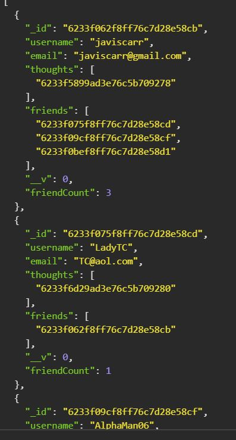
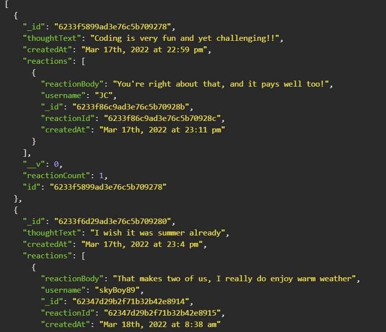

# Social_Network_API

# Table of Contents

- [Description](#description)
- [Demo](#demo)
- [Screenshots](#screenshots)
- [Usage](#usage)

# Description

This application serves as a `Back-End` Social Network API that allows users to post their thoughts that will be listed under their user name as well as allow others to create a reaction post to their thoughts. Users will also be able to add friends and see the username of various reaction post created to their thoughts. Each post is time stamped and given a unique id. This application also counts the number or reactions and friends that a user has.

# Demo

[Play Demo ](https://www.youtube.com/watch?v=QpwrUKqzxVI)

# Screenshots

_This image displays the `username` created along with the `email address` used to create the user. Then you notice a `thought id` number referencing that a thought has been posted. Under `friends`, you will notice an array of `user id` numbers as well indicating that this user has a number of 3 friends associated with this user. The friend count displays the number `3` to indicate that number._

_On this image you'll notice the `thought message` along with the the `date and time it was created`, followed by the `reaction message` and the `username` that created tha message which also displays `unique ids` for both the reaction and the username as well as list the `date and time created the reaction was created`._

# Usage

_Given the user has installed the necessary packages, the user would create a connection with `mongodb compass` then enter `npm start` in the command line to prompt the application to begin. Once you have started the server, then the user is able to `GET, POST, PUT, DELETE` using the appropriate routes created._

# Author

## **_Javis Carr_**

### **Email:** Javis.Carr@gmail.com

### **LinkedIn:** [Click here](https://www.linkedin.com/in/javis-carr-8a584533/)
